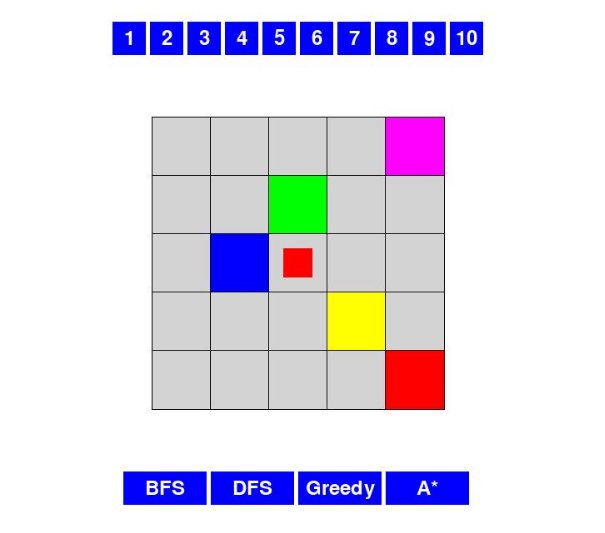

**Úvod**  

Lunar Landind je logická hra, v ktorej cieľom je dostať červenú figúrku do cieľového bodu na mape. Pohnúť môžeme hociktorou figúrkou, no tá sa hýbe dokiaľ nenarazí na inú figúrku. Pokiaľ  nemôže naraziť na žiadnu figúrku, nedokáže sa pohnúť. Môžeme sa hýbať v 4 smeroch  ↑ ↓ → ←.** Naše zadané algoritmy sú DFS, BFS, Greedy Search a A\*. 

**Reprezentácia Hry:** 

- Stav hry je reprezentovaný ako matica, kde každá bunka môže nadobudnúť tri stavy a to robota(A-E), hráča(X) alebo prázdne políčko(0) . 
- Každý algoritmus manipuluje a preskúmava rôzne stavy herného plánu na nájdenie riešenia. 

**Reprezentácia Ťahu:** 

- Ťahy sú reprezentované ako dvojice: znak robota a smer (napr. ('A', 'L') pre pohyb robota A doľava). 

**Vizualizácia:** 

- Stav hry sa vizualizuje pomocou knižnice Pygame. 
- Obrazovka sa aktualizuje v každom kroku na zobrazenie priebehu algoritmu. 

**Ovládanie hry:** 

- V hornej časti sú tlačidlá od 1 po 10 na zvolenie mapy, ktoré taktiež reprezentujú level a náročnosť hry. 
- V spodnej časti sú 4 tlačidlá, ktoré reprezentujú a jeho spustenie na danej mape. 

**Depth-First Search (DFS)** 

**Prehľad** 

Depth-First Search (DFS) je algoritmus, ktorý preskúma čo najďalej pozdĺž každej vetvy pred návratom. Systématicky sa pohybuje hlboko do priestoru vyhľadávania pred preskúmaním iných možností.  

1. Inicializácia: 
   1. Vytvoríme prázdny zásobník (dfs\_stack), ktorý bude obsahovať aktuálne ťahy, stavy hry, ich hĺbku a postupnosť ťahov pomocou ktorých sme sa dostali do aktuálneho stavu. 
   1. Do zásobníka pridáme záznam pre každý možný pohyb z počiatočného stavu hry, maticu počiatočného stavu, hĺbku jedna a históriu ťahov. 
1. Hlavný Cyklus: 
- Opakujeme, kým nie je zásobník prázdny: 
  - Vyberieme záznam zo zásobníka. 
  - Herné pole nastavíme na stav z vybraného záznamu. 
  - Vykonáme ťah. 
  - Skontrolujeme, či sme dosiahli cieľový stav. 
    - Ak áno, vypíšeme riešenie a ukončíme algoritmus. 
  - Ak nie, vygenerujeme možné ťahy pre aktuálny stav. 
  - Pre každý možný nový ťah: 
    - Pridáme nový záznam do zásobníka, kde každý záznam pozostáva z : 
1. Toho možného ťahu. 
1. Maticu aktuálneho herného poľa z ktorého bude vykonaný ťah. 
1. Aktualizovanú hĺbku stromu (+1) 
1. Aktualizovanú históriu ťahov. 

**Breadth-First Search (BFS)** 

**Prehľad** 

Breadth-First Search (BFS) je algoritmus, ktorý systematicky preskúma priestor možných ťahov, úroveň po úrovni, zabezpečujúc, že všetky uzly na určitej hĺbke sú navštívené pred prechodom na hlbšie úrovne.  

1. Inicializácia: 
   1. Vytvoríme prázdny front (bfs\_queue), ktorý bude obsahovať aktuálne ťahy, stavy hry, ich hĺbku a postupnosť ťahov pomocou ktorých sme sa dostali do aktuálneho stavu. 
   1. Do frontu pridáme záznam pre každý možný pohyb z počiatočného stavu hry, maticu počiatočného stavu, hĺbku jedna a históriu ťahov. 
1. Hlavný Cyklus: 
- Opakujeme, kým nie je front prázdny: 
  - Vyberieme záznam z frontu. 
  - Herné pole nastavíme na stav z vybraného záznamu. 
  - Vykonáme ťah. 
  - Skontrolujeme, či sme dosiahli cieľový stav. 
    - Ak áno, vypíšeme riešenie a ukončíme algoritmus. 
  - Ak nie, vygenerujeme možné ťahy pre aktuálny stav. 
  - Pre každý možný nový ťah: 
    - Pridáme nový záznam do frontu, kde každý záznam pozostáva z: 
1. Toho možného ťahu. 
1. Maticu aktuálneho herného poľa z ktorého bude vykonaný ťah. 
1. Aktualizovanú hĺbku stromu (+1) 
1. Aktualizovanú históriu ťahov. 

**Greedy Search** 

**Prehľad** 

Greedy Search je heuristický algoritmus, ktorý robí lokálne optimálne rozhodnutia v každom kroku. Priorizuje ťahy, ktoré sa zdajú najviac optimálne na základe heuristickej funkcie. 

Implementácia v Kóde: 

1. Inicializácia: 
   1. Vytvoríme prázdnu **prioritnú** **frontu** (greedy\_queue), ktorá bude obsahovať heuristiku pre aktuálny ťah, samotný ťah, stav hry, jeho hĺbku a postupnosť ťahov pomocou ktorých sme sa dostali do aktuálneho stavu. 
   1. Do frontu pridáme záznam pre každý možný pohyb z počiatočného stavu hry, vypočítame heuristiku pre daný ťah, samotný ťah, maticu počiatočného stavu, hĺbku jedna a históriu ťahov. 
1. Hlavný Cyklus: 
- Opakujeme, kým nie je fronta prázdna: 
  - Vyberieme záznam s najnižšou heuristikou z prioritnej fronty. 
  - Herné pole nastavíme na stav z vybraného záznamu. 
  - Vykonáme ťah. 
  - Skontrolujeme, či sme dosiahli cieľový stav. 
    - Ak áno, vypíšeme riešenie a ukončíme algoritmus. 
  - Ak nie, vygenerujeme možné ťahy pre aktuálny stav. 
  - Pre každý nový ťah: 
    - Pridáme nový záznam do frontu, kde každý záznam pozostáva z: 
1. Vypočítanej heuristiky toho možného nového ťahu. 
1. Toho možného ťahu. 
1. Maticu aktuálneho herného poľa, z ktorého bude vykonaný ťah. 
1. Aktualizovanú hĺbku stromu (+1). 
1. Aktualizovanú históriu ťahov. 

**A\* Search:** 

**Prehľad** 

A\* je informovaný algoritmus na hľadanie najkratších ciest v grafe. Využíva kombináciu heuristiky a nákladu pre pohyb medzi stavmi s cieľom dosiahnuť optimálne riešenie**.** 

Implementácia v Kóde: 

1. Inicializácia: 
   1. Vytvoríme prázdnu **prioritnú** **frontu** (a\_star\_queue), ktorá bude obsahovať heuristiku pre aktuálny ťah + hodnotu komutatívnu cestu, samotný ťah, stav hry, postupnosť ťahov pomocou ktorých sme sa dostali do aktuálneho stavu a komutatívnu cestu. 
   1. Do frontu pridáme záznam pre každý možný pohyb z počiatočného stavu hry 
1. Hlavný Cyklus: 
- Opakujeme, kým nie je fronta prázdna: 
  - Vyberieme záznam s najnižšou hodnotou( komutatívna cesta + heuristika ) z prioritnej fronty. 
  - Herné pole nastavíme na stav z vybraného záznamu. 
  - Vykonáme ťah. 
  - Skontrolujeme, či sme dosiahli cieľový stav. 
    - Ak áno, vypíšeme riešenie a ukončíme algoritmus. 
  - Ak nie, vygenerujeme možné ťahy pre aktuálny stav. 
  - Pre každý nový ťah: 
    - Pridáme nový záznam do frontu, kde každý záznam pozostáva z: 
1. Vypočítanej heuristiky toho možného nového ťahu + komutatívna cesta. (slúži na určenie poradia) 
1. Toho možného ťahu. 
1. Maticu aktuálneho herného poľa, z ktorého bude vykonaný ťah. 
1. Aktualizovanú históriu ťahov. 
1. Komutatívnu cestu 

**Porovnanie Algoritmov** 

**Tabuľka výsledkov** 

|Mapy |BFS |DFS |Greedy |A\* |
| - | - | - | - | - |
|1 |14 / 4 |7 / 4 |9 / 4 |10 / 4 |
|2 |32 / 6 |25 / 6 |27 / 6 |31 / 6 |
|3 |299 / 6 |34 / 9 |218 / 7 |293 / 7 |
|4 |246 / 6 |8 / 6 |108 / 6 |215 / 6 |
|5 |2072 / 10 |28 / 10 |929 / 15 |1308 / 10 |
|6 |2614 / 10 |1845 / 18 |588 / 15 |2038 / 10 |
|7 |1860 / 8 |1152 / 12 |1293 / 8 |970 / 8 |
|8 |377 / 8 |251 / 8 |193 / 8 |386 / 8 |
|9 |387 / 10 |167 / 13 |211 / 10 |377 / 11 |
|10 |209 / 5 |144 / 9 |183 / 5 |261 / 5 |

**Počet navštívených stavov (priemer):** 

- **BFS: 811**  
- **DFS: 366**  
- **Greedy: 375.9** 
- ***A:*\* 588.9**  

**Počet krokov (hlbka):** 

- **BFS: 7.3**  
- **DFS: 9.5** 
- **Greedy: 8.4** 
- ***A*\*: 7.5** 

**Záver:** 

- **BFS** a **A\*** majú podobný priemerný počet navštívených stavov, ale A\* dosahuje nižšiu priemernú hĺbku. 
- **DFS** dosahuje nízky priemerný počet navštívených stavov, ale aj vyššiu hĺbku. 
- **Greedy** dosahuje nízky priemerný počet navštívených stavov s relatívne nízkou hĺbkou. 
- **A\*** dosahuje vyvážený výsledek medzi počtom navštívených stavov a hĺbkou, súčasne s nízkym priemerným počtom krokov. 

Pri hľadaní najkratších ciest s minimálnym počtom krokov je výberom BFS alebo A\* (  nie vždy, keďže v našej implementácii hľadá A\* cestu s najmenším počtom prejdených políčok )možné dosiahnuť optimálne riešenia. V prípade, že uprednostníme efektivitu v počte navštívených stavov a nie je nevyhnutné dosiahnuť absolútne optimálne riešenie, Greedy predstavuje rýchlu alternatívu.
